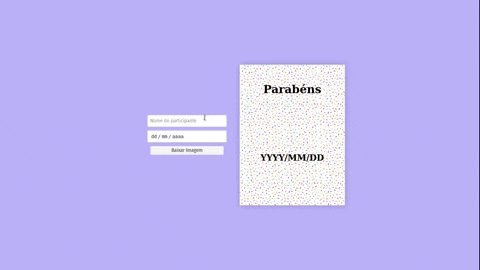

# Tranformando HTML em Imagens

## Esse repositório foi criado para auxiliar um post feito por mim no [dev.to](https://dev.to/)
### [Ir para o post](https://dev.to/cjuniordev/transformando-html-em-imagens-2k5e)

## Techs utilizadas
- HTML
- CSS
- JS

## Me ache nas redes como: cjuniordev, ou no linkedin: Carlos Rogério